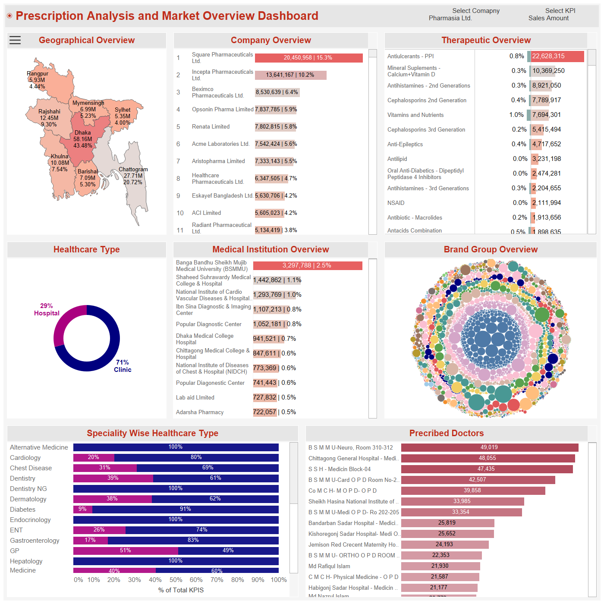

# Data Analyst | Business Intelligence Analyst

## 🔀 Quick Navigation

[**About Me**](#about-me) | [**📂 Portfolio Projects**](#portfolio-projects) | [**💼 Work Experience**](#work-experience) | [**🛠️ Technical Skills**](#technical-skills)

---

## About Me

Data Analyst with 4+ years of experience turning complex data into actionable insights. Skilled in SQL, Power BI, Tableau, and Python with strong expertise in data modeling, ETL processes, and dashboard development. Passionate about leveraging data to solve business problems and improve efficiency.

## 💡 What I Do Best

* Build **impactful dashboards** in Tableau & Power BI
* Develop **data warehouse & ETL pipelines** (SSIS, Azure Data Factory, BigQuery)
* Solve problems with **SQL, Python, and DAX**
* Optimize reporting processes to save hours of manual work

---

## 🛠️ Technical Skills

* **Data Analysis**: Excel, Google Sheets, SQL (SQL Server, IBM Db2, PostgreSQL, BigQuery, MySQL), Python (Pandas, NumPy, Matplotlib), MATLAB, Minitab
* **Visualization**: Power BI, Tableau, Google Looker Studio, IBM Cognos
* **Data Warehousing**: SSIS, Azure Data Factory, Google BigQuery
* **Programming**: Python
* **Other Software**: MS Word, PowerPoint, MS Visio, SolidWorks, Premiere Pro

---

## 🎓 Education

* **M.Sc., Computer Science & Engineering (Data Science)** | United International University (*Ongoing, CGPA 3.72*)
* **B.Sc., Industrial & Production Engineering** | Ahsanullah University of Science & Technology (*2020, CGPA 3.67*)

---

## 💼 Work Experience

**Data Analyst @ VS One World (*Jan 2024 – Present*)**

* **Tools & Tech:** Tableau, Power BI | **Languages:** SQL, Python, DAX

**BI Analyst (Senior Executive) @ 10 Minute School (*Jun 2023 – Dec 2023*)**

* **Tools & Tech:** Google Cloud Platform, BigQuery, Google Data Studio, Metabase | **Languages:** MySQL, Python

**Data Analyst (Executive) @ Kaz Software (*Apr 2022 – May 2023*)**

* **Tools & Tech:** MS Azure SQL Server, SSMS, SSIS, Azure Data Factory, Visual Studio, Azure DevOps, Power BI Premium | **Languages:** T-SQL, M-Query, DAX

**Assistant Executive (Data Cell) @ Epyllion Group (*Sep 2020 – Nov 2021*)**

---

## 📜 Certifications

* IBM Data Analyst Professional Certificate
* Tableau Fundamentals, Intermediate, Advanced & Tableau Prep
* Power BI Data Analytics – 365datascience.com
* Machine Learning Specialization – Andrew Ng
* Databases and SQL for Data Science – Coursera
* Advanced SQL: Logical Query Processing – LinkedIn
* Python for Data Science, AI & Development – Coursera
* Statistics Foundation 1, 2 & 3 – LinkedIn

---

## 📂 Portfolio Projects

> **How this section works:** The **image is always visible**. Click **“Show details”** to toggle the description, business value, and links.

---

### 📊 Pharmaceutical Prescription Analysis & Market Overview

  
<strong>Show details</strong>

   

**Domain:** Pharma Analytics | **Region:** Bangladesh

**Summary:**
Developed a comprehensive, interactive dashboard for analyzing prescription trends and market dynamics in the pharmaceutical sector of Bangladesh. The multi-page report enables stakeholders to monitor market share, brand performance, prescriber behavior, competitor benchmarking, and untapped market opportunities—within a single, unified platform.

**Business Value Delivered:**

* Granular prescription tracking from national level to individual doctor level
* Competitive benchmarking by product, geography, and specialty
* Identification of white-space markets and brand placement opportunities
* Support for strategic planning and targeting for medical reps and marketing teams

**Links:**

* ▶️ **View Dashboard:** [https://tinyurl.com/y7n376yy](https://tinyurl.com/y7n376yy)
* 💻 **View Code (GitHub):** *Add your repo link here*

---

### 📊 Project Title 2

  
<strong>Show details</strong>

   

**Domain:** \[Domain Here] | **Region:** \[Region Here]

**Summary:**
Short description of project purpose, dataset, techniques used, and insights delivered.

**Business Value Delivered:**

* Point 1
* Point 2

**Links:**

* ▶️ **View Dashboard:** [https://example.com/dashboard2](https://example.com/dashboard2)
* 💻 **View Code (GitHub):** [https://github.com/username/repo2](https://github.com/username/repo2)

---

### 📊 Project Title 3

  
<strong>Show details</strong>

   

**Domain:** \[Domain Here] | **Region:** \[Region Here]

**Summary:**
Short description of project purpose, dataset, techniques used, and insights delivered.

**Business Value Delivered:**

* Point 1
* Point 2

**Links:**

* ▶️ **View Dashboard:** [https://example.com/dashboard3](https://example.com/dashboard3)
* 💻 **View Code (GitHub):** [https://github.com/username/repo3](https://github.com/username/repo3)

---

