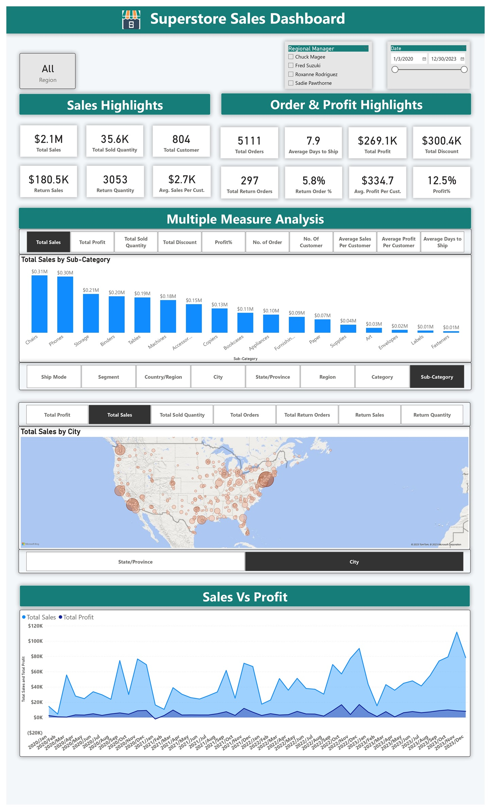
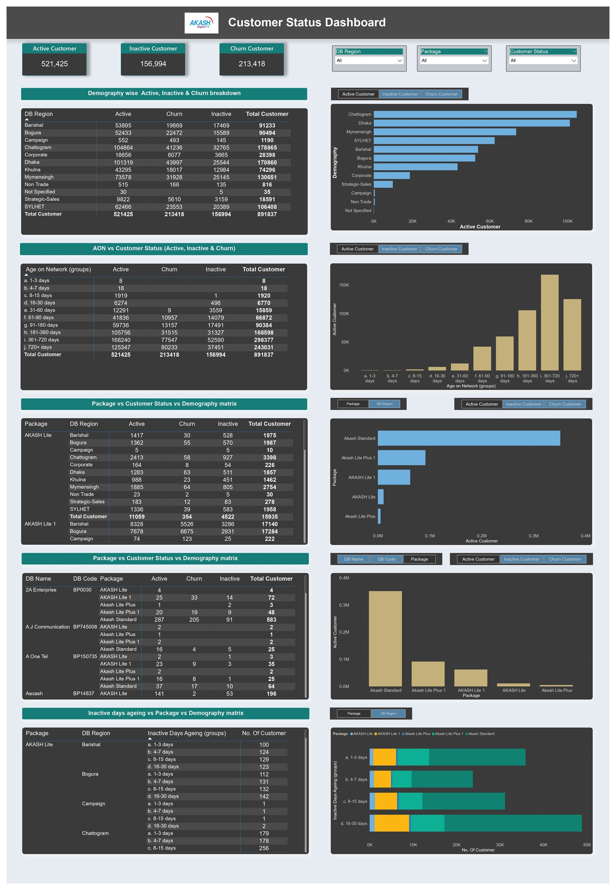
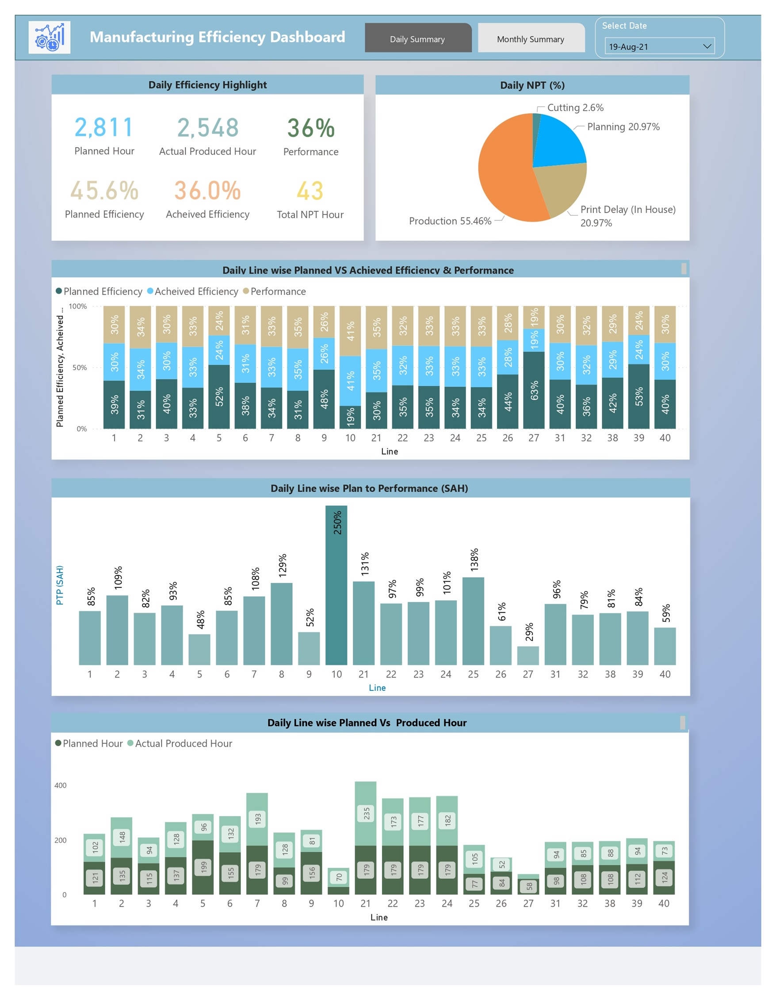
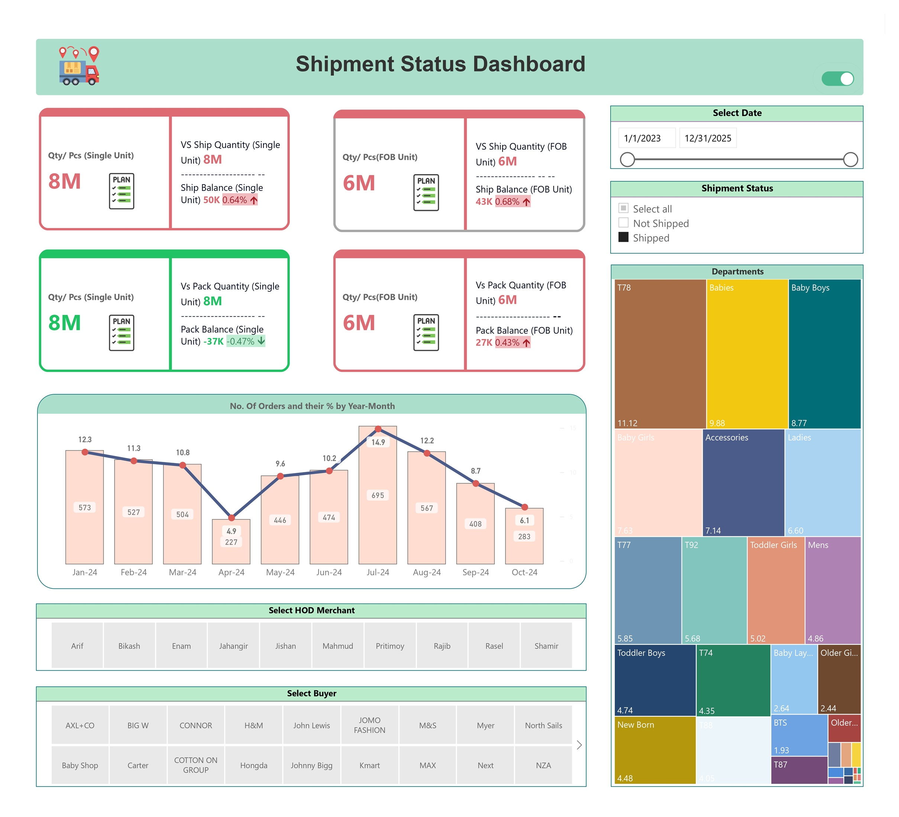
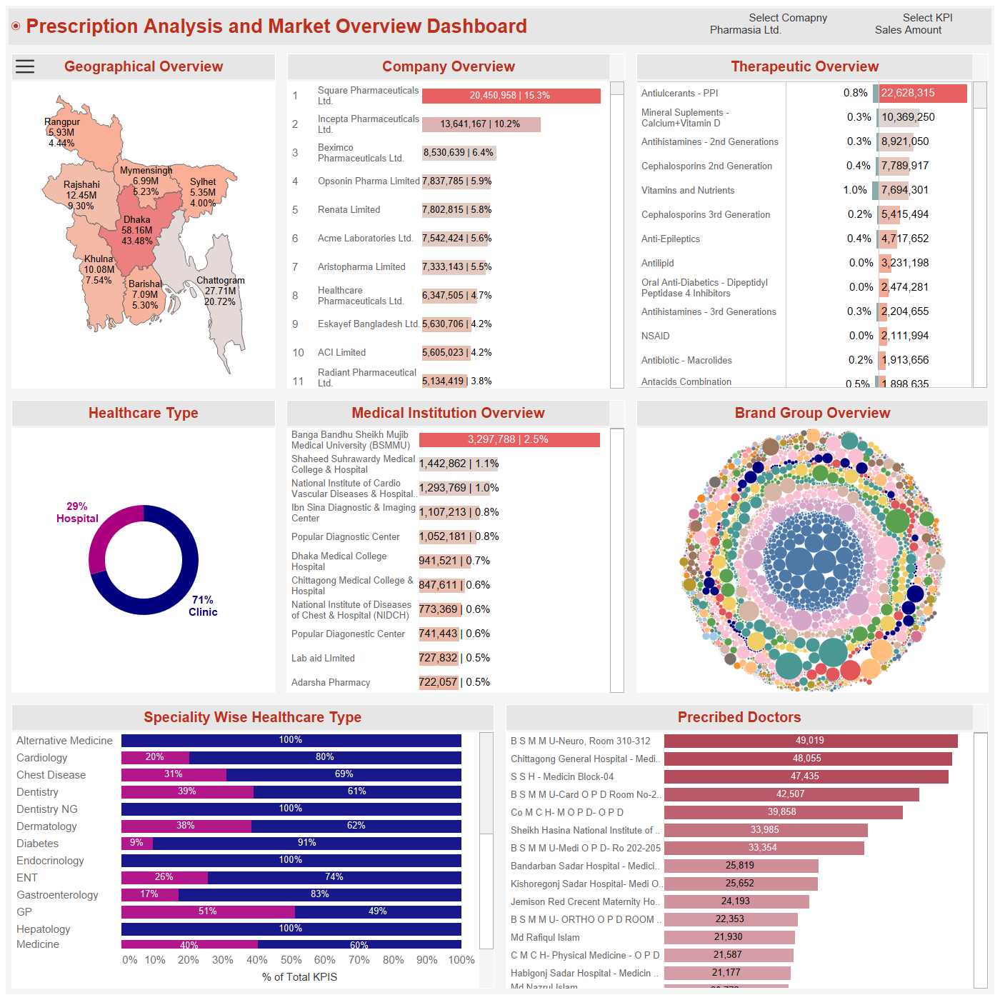
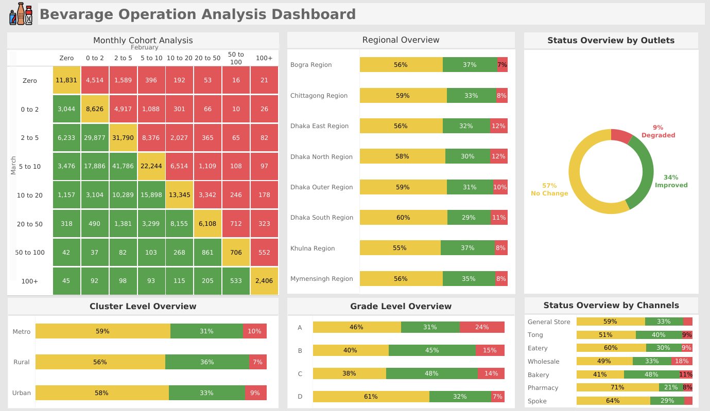
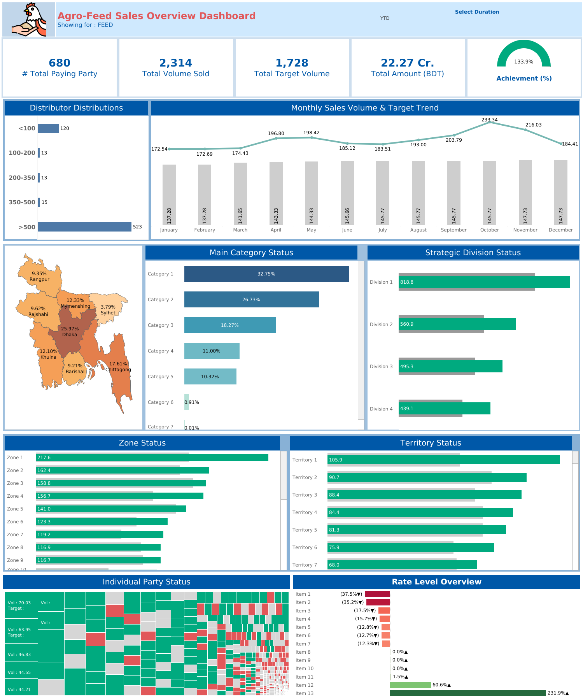
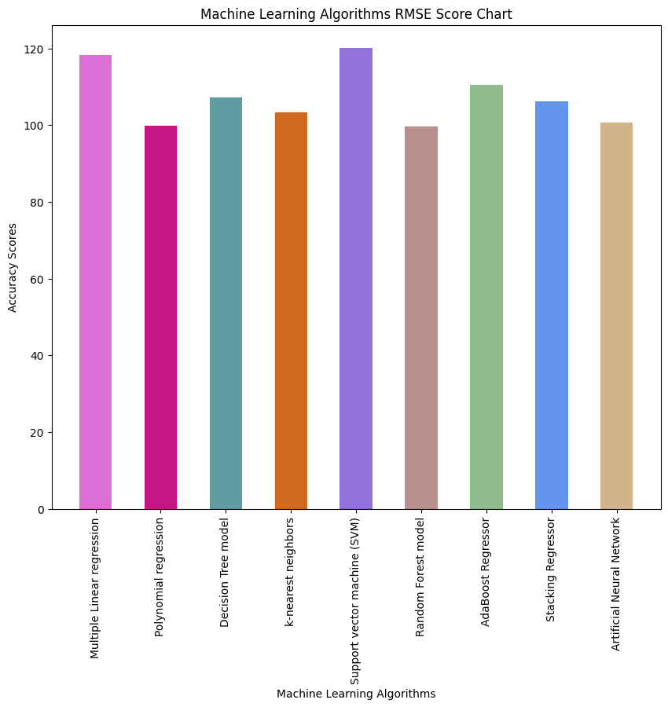
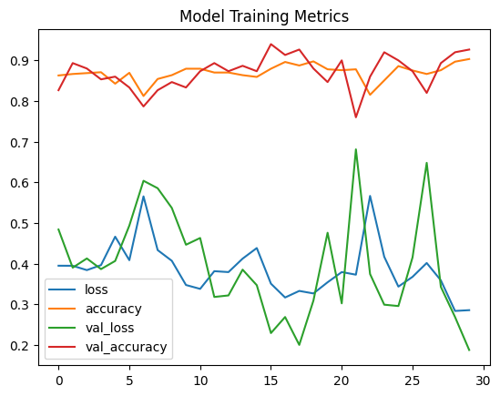

## 🔀 Quick Navigation

<a href="#about-me"><b>About Me</b></a> &nbsp; | &nbsp;
<a href="#technical-skills"><b>🛠️ Technical Skills</b></a> &nbsp; | &nbsp;
<a href="#portfolio-projects"><b>📂 Portfolio Projects</b></a> → 
<a href="#power-bi-projects">Power BI</a> | 
<a href="#sql-projects">SQL</a> | 
<a href="#tableau-projects">Tableau</a> | 
<a href="#ml-projects">ML</a> &nbsp; | &nbsp;
<a href="#education-and-certifications"><b>🎓 Education & Certifications</b></a> &nbsp; | &nbsp;
<a href="#work-experience"><b>💼 Work Experience</b></a>

---

  

## About Me

Results-driven Data Analyst with 4+ years of experience in the full data lifecycle from building robust ETL pipelines and data warehouses to designing impactful dashboards. My passion lies in transforming complex data into actionable insights that drive business growth and optimize performance. I have a proven track record of developing and deploying BI solutions that have directly increased sales, improved campaign ROI, and enhanced operational efficiency for a variety of key clients. 

**What I Do Best**

* **Build impactful dashboards & reports** in Tableau and Power BI.
* **Design and deploy end-to-end data pipelines** using SSIS, Azure Data Factory, and Google BigQuery.
* **Extract and transform data** using advanced SQL, Python (Pandas, NumPy), and DAX.
* **Optimize data processes**, cutting down manual effort and improving reporting efficiency.

---

## 🛠️ Technical Skills

* **BI & Visualization:** Power BI, Tableau, Google Looker Studio, IBM Cognos, Metabase, Excel
* **Database & ETL:** SQL (SQL Server, IBM Db2, PostgreSQL, MySQL, BigQuery), SSIS, Azure Data Factory, Google Dataform
* **Programming & Scripting:** Python (Pandas, NumPy, Matplotlib), T-SQL, M-Query, DAX
* **Other:** MS Visio, SolidWorks, Premiere Pro

---

## 📂 Portfolio Projects

### 🔹 Power BI Projects

#### 📊 Superstore Sales Analysis

**Project Summary:**  

Analyzed superstore sales data to gain insights into sales performance, profitability, and customer behavior. Developed a comprehensive dashboard using Power BI to identify opportunities for improvement and optimize business operations.

**Links:**
* 💻 **View Code (GitHub):** [Click to view project details](https://github.com/Md-GolamSarwar-E-Azam/Portfolio-Projects_Description/blob/main/Optimize%20Operations%20and%20Drive%20Growth%20in%20a%20Superstore/readme.md)

---
#### 📊 Customer Satisfaction and Loyalty Analysis

**Project Summary:**  

Analyzed Akash Digital TV customer churn data using Power BI to identify key factors influencing customer retention. Developed targeted retention strategies and optimized subscription packages to improve customer satisfaction and reduce churn.

**Links:**
* 💻 **View Code (GitHub):** [Click to view project details](https://github.com/Md-GolamSarwar-E-Azam/Portfolio-Projects_Description/blob/main/Improve%20Customer%20Satisfaction%20and%20Loyalty%20at%20Akash%20Digital%20TV/readme.md)

---
#### 📊 Manufacturing Efficiency Analysis

**Project Summary:**  

Analyzed RMG factory manufacturing efficiency data to identify bottlenecks, optimize production planning, and reduce non-productive time. Developed a dashboard using Power BI to visualize key metrics and enable data-driven decision-making.

**Links:**
* 💻 **View Code (GitHub):** [Click to view project details](https://github.com/Md-GolamSarwar-E-Azam/Portfolio-Projects_Description/blob/main/Manufacturing%20Efficiency%20Dashboard%20using%20Power%20BI/readme.md)

---
#### 📊 Shipment Status Dashboard

**Project Summary:**  

In this project I have developed a Shipment Status Dashboard for manufacturing factories to monitor shipment and packing performance against planned quantities. The dashboard provides real-time visibility into shipment balance, packaging status, and order performance, enabling better coordination between departments and buyers.

**Links:**
* 💻 **View Code (GitHub):** [Click to view project details](https://github.com/Md-GolamSarwar-E-Azam/Portfolio-Projects_Description/blob/main/Shipment%20Status%20Dashboard/readme.md)
 
---
### 🔹 SQL Projects

---

#### 📊 Analyzing Netflix Content Trends

**Project Summary:**  

Explored Netflix dataset using SQL queries to understand content trends, growth, and popularity. Key insights include country association, top directors, movie vs. TV show balance, and genre growth rates. 

**Links:**
* 💻 **View Code (GitHub):** [Click to view project details](https://github.com/Md-GolamSarwar-E-Azam/Portfolio-Projects_Description/blob/main/Analyzing%20Netflix%20Content%20Trends/readme.md)

---

### 🔹 Tableau Projects

#### 📊 Pharmaceutical Prescription Analysis & Market Overview

**Project Summary:**  

Developed a comprehensive, interactive dashboard for analyzing prescription trends and market dynamics in the pharmaceutical sector of Bangladesh. The multi-page report enables stakeholders to monitor market share, brand performance, prescriber behavior, competitor benchmarking, and untapped market opportunities within a single, unified platform. 

**Business Value Delivered:**
* Granular prescription tracking from national level to individual doctor level
* Competitive benchmarking by product, geography, and specialty
* Identification of white-space markets and brand placement opportunities
* Support for strategic planning and targeting for medical reps and marketing teams

**Links:**
* ▶️ **View Dashboard:** [Click to view the dashboard](https://public.tableau.com/views/PrescriptionAnalysis_17555135714300/Status?:language=en-US&:sid=&:redirect=auth&:display_count=n&:origin=viz_share_link)
* 💻 **View Project Details (GitHub):** [Click to view project details](https://github.com/Md-GolamSarwar-E-Azam/Portfolio-Projects_Description/blob/main/Pharmaceutical%20Prescription%20Analysis%20%26%20Market%20Overview%20Dashboard/README.md)

---

#### 📊 Supplier Performance & Promotion Analysis Dashboard

**Project Summary:**  

 Developed a Supplier Profitability and Contribution Dashboard for SuperShop, designed to provide decision-makers with clear insights into supplier performance, sales contribution, and profitability. 

**Business Value Delivered:**  

 Enabled management to identify high-value suppliers, track underperforming ones, optimize purchasing & promotional strategies, and strengthen supply strategy alignment with revenue goals. 

**Links:**
* ▶️ **View Dashboard:** [Click to view the dashboard](https://public.tableau.com/views/SupplierAnalysisdashboard/Supplierwiseanalytics?:language=en-US&publish=yes&:sid=&:redirect=auth&:display_count=n&:origin=viz_share_link)
* 💻 **View Project Details (GitHub):** [Click to view project details](https://github.com/Md-GolamSarwar-E-Azam/Portfolio-Projects_Description/blob/main/Supplier%20Performance%20%26%20Promotion%20Analysis%20Dashboard/readme.md)

---

#### 📊 Beverage Company Outlet Operations Analysis Dashboard

**Project Summary:**  

 This dashboard focuses on operational performance of beverage sales outlets, tracking trends and KPIs to identify areas of improvement. 

**Business Value Delivered:**  

 Enables sales and management teams to make targeted interventions, track outlet health, and optimize operational efficiency and sales growth. 

**Links:**
* ▶️ **View Dashboard:** [Click to view the dashboard](https://public.tableau.com/views/BevarageOperationAnalysis/Summary?:language=en-US&:sid=&:redirect=auth&:display_count=n&:origin=viz_share_link)
* 💻 **View Project Details (GitHub):** [Click to view project details](https://github.com/Md-GolamSarwar-E-Azam/Portfolio-Projects_Description/blob/main/Bevarage%20Operation%20Analysis%20Dashboard/readme.md)

---

#### 📊 Agro Feed Sales Performance Dashboard

**Project Summary:**  

 Dashboard for tracking sales outlet and product performance for an agribusiness company. 

**Business Value Delivered:**  

 Facilitates actionable insights for sales interventions, distributor segmentation, target monitoring, and pricing optimization. 

**Links:**
* ▶️ **View Dashboard:** [Click to view the dashboard](https://public.tableau.com/views/FeedSales_TargetOverview/Summary?:language=en-US&:sid=&:redirect=auth&:display_count=n&:origin=viz_share_link)
* 💻 **View Project Details (GitHub):** [Click to view project details](https://github.com/Md-GolamSarwar-E-Azam/Portfolio-Projects_Description/blob/main/Agro%20Feed%20%20Sales%20Overview%20Dashboard/readme.md)

---

#### 📊 Supershop Sales Analytics Dashboard

**Project Summary:**  

 Comprehensive SuperShop Sales Analysis Dashboard for monitoring KPIs and trends. 

**Business Value Delivered:**  

 Supports data-driven decisions, highlights top-performing outlets, underperforming products, and seasonal trends to optimize inventory and marketing strategies. 

**Links:**
* ▶️ **View Dashboard:** [Click to view the dashboard](https://public.tableau.com/views/SupershopSalesAnalytics/Summary?:language=en-US&:sid=&:redirect=auth&:display_count=n&:origin=viz_share_link)
* 💻 **View Project Details (GitHub):** [Click to view project details](https://github.com/Md-GolamSarwar-E-Azam/Portfolio-Projects_Description/blob/main/Supershop%20Sales%20Analytics/readme.md)

---

### 🔹 ML Projects

#### 📊 IOT Driven Crop Recommender System

**Project Summary:**  

 IoT-based crop recommender system for precision agriculture. Provides real-time crop recommendations using sensor data, machine learning, and cloud computing. Optimizes resource utilization, increases crop productivity, and minimizes environmental impact. 

**Links:**
* ▶️ **View App:** [Click to view the Web App](https://croprecommender.anvil.app/)
* 💻 **View Project Details (GitHub):** [Click to view project details](https://github.com/Md-GolamSarwar-E-Azam/Portfolio-Projects_Description/blob/main/IOT%20Driven%20Crop%20Recommender%20System/readme.md)
* ▶️ **View Colab Notebook:** [Click to view the code](https://colab.research.google.com/drive/1S74GQ0mPJ7lsJaxWqShPSXyjwYYaUbUw)

---
#### 📊 Rainfall Prediction from 65 Years of Weather data of Bangladesh using supervised machine learning algorithms

**Project Summary:**  

 Rainfall prediction model for Bangladesh using supervised machine learning. Achieved 0.7644 R-squared and 99.12 RMSE using Polynomial Regression. Demonstrates potential for agricultural planning and disaster management. 

**Links:**
* 💻 **View Project Details (GitHub):** [Click to view project details](https://github.com/Md-GolamSarwar-E-Azam/Portfolio-Projects_Description/blob/main/Rainfall%20Prediction%20from%2065%20Years%20of%20Weather%20data%20of%20Bangladesh%20using%20supervised%20machine%20learning%20algorithms/readme.md)
* ▶️ **View Colab Notebook:** [Click to view the code](https://colab.research.google.com/drive/1GMw2AFhALPT_xZA8flXm-0dSD0uExhuY?authuser=1#scrollTo=8_FyW7E-4mpg)

---
#### 📊 Banhladeshi Bank Note Detection Using CNN

**Project Summary:**  

 CNN-based banknote recognition system accurately classifies Bangladeshi banknotes, even those that are old or worn-out. Achieved 92.67% validation accuracy, suitable for ATMs, currency exchange centers, and other financial institutions. 

**Links:**
* 💻 **View Project Details (GitHub):** [Click to view project details](https://github.com/Md-GolamSarwar-E-Azam/Portfolio-Projects_Description/blob/main/Banhladeshi%20Bank%20Note%20Detection%20Using%20CNN/readme.md)
* ▶️ **View Colab Notebook:** [Click to view the code](https://colab.research.google.com/drive/1nqbh2Da5HsLAqikExeB5nWm_jV1myqvX?usp=sharing)

---

<!-- Add Machine Learning projects here -->

## 🎓 Education & Certifications

* **M.Sc., Computer Science & Engineering (Data Science)** | United International University *(Ongoing, CGPA 3.72)*
* **B.Sc., Industrial & Production Engineering** | Ahsanullah University of Science & Technology *(2020, CGPA 3.67)*

**Certifications**
* **IBM Data Analyst Professional Certificate**
* **Tableau Fundamentals, Intermediate, & Advanced** (Tableau eLearning)
* **Power BI Data Analytics** (365datascience.com)
* **Machine Learning Specialization** (Andrew Ng)
* **Databases and SQL for Data Science** (Coursera)
* **Advanced SQL: Logical Query Processing** (LinkedIn)
* **Python for Data Science, AI & Development** (Coursera)

---

## 💼 Work Experience

**Data Analyst @ VS One World** | *Jan 2024 – Present*
* Built Budget & Sales Dashboards to aid strategic financial tracking for a major pharmaceutical client (Square Pharma).
* Developed a Marketing & Sales Dashboard for Radiant Pharma, which led to a **20% improvement in campaign ROI**.
* Designed a Sales Performance Dashboard for Paragon Group, contributing to a **10% boost in sales**.

**BI Analyst (Senior Executive) @ 10 Minute School** | *Jun 2023 – Dec 2023*
* Created an Affiliate KPI Tracker Dashboard, **boosting partner-driven sign-ups by 15%**.
* Built an Academic Dashboard to analyze student behavior, resulting in a **12% improvement in student retention**.
* Developed key dashboards for FB & Google Ads to optimize digital marketing performance and ROI.
* Increased course revenue by **10%** through the development of a Product Revenue Dashboard.

**Data Analyst (Executive) @ Kaz Software** | *Apr 2022 – May 2023*
* Deployed data warehouse and ETL pipelines using **SSIS, ADF, and Azure SQL** for a major client (Japan Tobacco International).
* Built a Power BI dashboard to monitor daily efficiency across **60+ field locations**.
* Enhanced an In-Market Sales Dashboard, **cutting data refresh time by 40%**.

**Assistant Executive (Data Cell) @ Epyllion Group** | *Sep 2020 – Nov 2021*
* Contributed to the development of RMG database models and ERP system implementation.
* Converted **10+ Excel dashboards to Power BI**, reducing manual effort by **~60%**.
